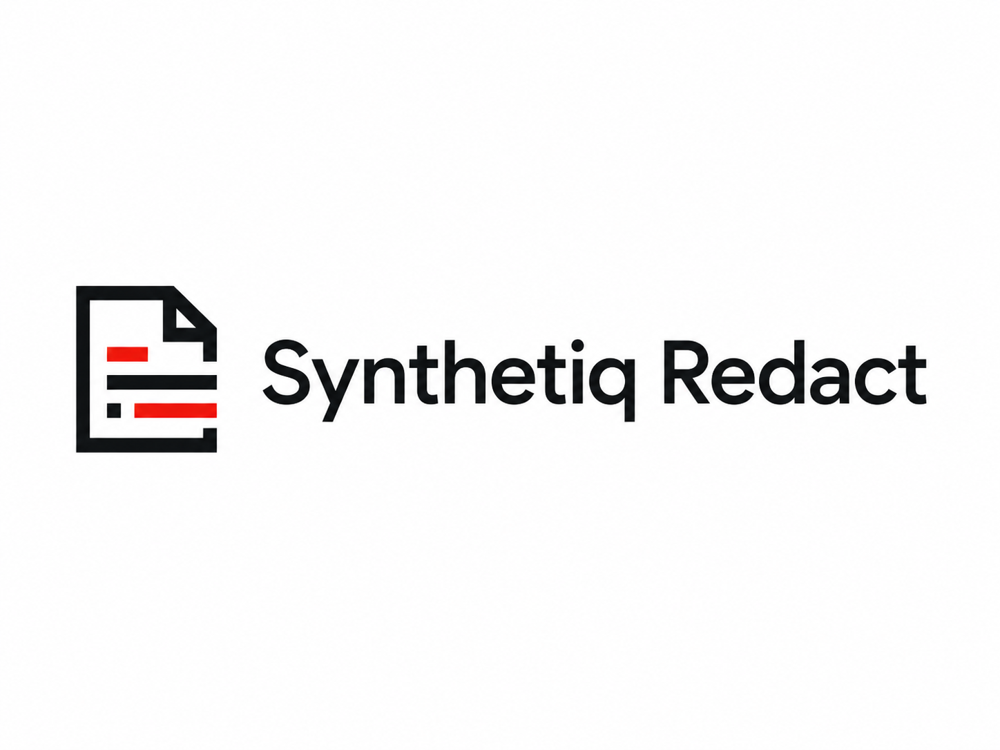

# Synthetiq Redact

<p align="center">
  
</p>

<p align="center">
  Local-first document redaction review for councils, FOI/SAR teams, and privacy-sensitive casework.
</p>

Synthetiq Redact is a local-first redaction system for scanned, photographed, PDF, and Word-style paperwork. It combines OCR, layout mapping, PII detection, human review, pixel-burned redaction output, local audit trails, and provenance lookup into one desktop-first workflow.

It is designed to assist trained reviewers. It does not make final legal disclosure decisions by itself.

## Current Product Shape

Synthetiq Redact now has three practical surfaces:

- **Desktop app**: a Tauri desktop shell around the React review UI.
- **Local backend**: FastAPI/Python OCR, redaction, export, and provenance engine.
- **Review workspace**: side-by-side original/redacted document review with manual box editing, live preview, OCR text selection, export, library, and provenance lookup.

The current default is **Individual Mode**: the desktop app starts the local backend on the same machine and stores data locally.

The planned production direction is **Enterprise Mode**: one main server runs the backend, database, queue, models, and storage while other devices run lightweight clients on the same network.

## What It Does

- Upload images, PDFs, and Word-derived documents.
- Render documents into reviewable page images.
- Extract clean text and OCR geometry.
- Detect sensitive values such as names, addresses, phone numbers, emails, references, NHS numbers, tenancy/account numbers, signatures, and similar case identifiers.
- Keep labels visible where possible and redact the sensitive value.
- Draw opaque black pixel redactions instead of reversible PDF overlays.
- Let reviewers approve, remove, resize, and add redaction boxes.
- Show a live redacted preview without forcing full page reloads for every edit.
- Export a burned redacted PDF.
- Save original/redacted document records into a local library.
- Store local audit and provenance metadata.
- Decode Synthetiq Redact provenance IDs from exported documents through the Find ID workflow.

## Main Redaction Path

The preferred processing path is:

```text
Synthetiq Redact v3
GLM OCR text + value-level geometry mapping + local redaction rules
```

The app deliberately treats this as the main path. Fallback OCR geometry is blocked by default and must be explicitly enabled in preferences. This prevents the UI from silently switching to weaker mapping and giving inconsistent results.

## Safety Model

The core rule is:

```text
Keep field labels visible.
Redact sensitive values.
If confidence is low, make the reviewer aware.
Never rely on reversible PDF overlays for final release.
```

Examples:

```text
Phone: [REDACTED-phone]
Email: [REDACTED-email]
Address: [REDACTED-address]
NHS Number: [REDACTED-nhs_number]
```

The exported redacted PDF is raster-burned so the hidden text is not simply selectable underneath black boxes.

## Local Provenance

Each installed server creates its own local provenance instance. Redacted exports receive a signed local Synthetiq Redact ID that can be looked up on the same server that produced it.

This is not a public global ID system. It is intentionally local:

- Server A can resolve documents produced by Server A.
- Server B cannot resolve Server A's private library records.
- IDs are signed with the local server secret.
- Runtime provenance data and secrets live under `backend/data/provenance/` and are ignored by Git.

The current implementation includes a machine-readable visual watermark plus PDF metadata fallback. The product direction is to replace the visible QR-style mark with a smaller branded Synthetiq Redact micro-mark that is less visually intrusive while remaining readable by this system.

## Operating Modes

### Individual Mode

For one user on one computer:

- App and backend run on the same machine.
- Uses local storage and local database.
- No login screen by default.
- Best for demos, solo use, and prototype testing.

### Enterprise Mode

For councils or teams:

- One main server runs the backend, models, queue, database, storage, audit, and provenance library.
- Staff devices run frontend clients and connect over the local network.
- Users upload and review documents from their own devices.
- Heavy OCR/redaction work happens on the server.

Enterprise Mode still needs hardening before production: PostgreSQL, Redis/Celery or equivalent job queue, role-based access, backups, retention jobs, monitoring, and server deployment runbooks.

## Project Structure

```text
backend/              FastAPI backend, OCR, redaction, export, provenance
frontend/             React + Vite UI and Tauri desktop app
frontend/public/brand Synthetiq Redact logo and app branding
mobile/               Experimental Flutter mobile client
docs/                 Security, roadmap, compliance, and training notes
dataset_text_prompts/ Synthetic prompt/source text work
```

Runtime data is intentionally not committed:

```text
backend/data/uploads/
backend/data/processed/
backend/data/provenance/
backend/data/*.sqlite3
```

## Desktop App

The desktop launcher starts the local backend and then opens the Tauri app.

Current Windows launcher:

```powershell
.\launch-synthetiq-redact-desktop.ps1
```

The desktop build is produced from:

```powershell
cd frontend
npm run app:build
```

The latest local app build used by the desktop shortcut is stored outside Git under:

```text
C:\Users\INTERPOL\Tools\SynthetiqRedact\
```

## Developer Quick Start

### Backend

```powershell
cd backend
python -m venv venv
.\venv\Scripts\activate
pip install -r requirements.txt
python -m spacy download en_core_web_sm
python -m uvicorn main_v2:app --host 127.0.0.1 --port 8000
```

Health check:

```text
http://127.0.0.1:8000/health
```

### Frontend

```powershell
cd frontend
npm install
npm run dev -- --host 127.0.0.1 --port 5173
```

Open:

```text
http://127.0.0.1:5173/
```

### Desktop Dev

```powershell
cd frontend
npm run app:dev
```

## Local AI Requirements

The main V3 path expects a local GLM OCR model served through Ollama:

```text
glm-ocr:latest
```

When GLM/Ollama is not available, the app can either:

- fail safely and ask the reviewer to start the main engine, or
- use the weaker OCR fallback only if explicitly enabled in preferences.

Other local components include:

- EasyOCR for baseline OCR/geometry fallback.
- spaCy for local entity recognition support.
- PyMuPDF/Pillow/OpenCV for document rendering, image processing, export, and provenance decode.
- Optional local LLM/VLM tools for future verification and classification paths.

No paid cloud OCR API is required for the local pilot.

## Validation Commands

From the repository root:

```powershell
cd frontend
npm run build
npm run app:build
```

Backend provenance check:

```powershell
python backend\scripts\test_provenance_watermark.py
```

General Python sanity check:

```powershell
python -m py_compile backend\*.py
```

## Current Limitations

- The current backend is still local-first and not yet a production multi-user queue.
- SQLite is suitable for local pilot use, not a shared council deployment.
- Multiple simultaneous redaction jobs can still stress local GPU/OCR resources until the queue/worker architecture is added.
- GLM OCR must be running locally for the best V3 path.
- Fallback OCR can be less precise on handwriting and is intentionally opt-in.
- The visual provenance watermark is functional but needs a less intrusive branded micro-mark design.
- Enterprise deployment still needs PostgreSQL, Redis/job queue, storage hardening, RBAC, monitoring, retention policies, and backup/restore.

## Future Direction

The intended product roadmap is:

1. **Individual Mode polish**
   - Reliable one-click desktop install.
   - Better local engine setup/checks.
   - Cleaner startup, loading, and offline states.

2. **Enterprise Mode**
   - Main server role.
   - Client device role.
   - Central database and document library.
   - Queue-based multi-user processing.
   - Admin dashboard for GPU, queue, users, storage, and model health.

3. **Synthetiq Files integration**
   - Phone-to-desktop document transfer.
   - Local network file movement.
   - Scan on mobile, redact on workstation/server, store in shared local library.

4. **Production compliance**
   - Audit log hardening.
   - Retention and deletion workflows.
   - Role-based approvals.
   - Export verification.
   - Council deployment guidance.

5. **Better provenance**
   - Replace the QR-style mark with a small branded Synthetiq Redact micro-mark.
   - Keep lookup local to the producing server.
   - Support document search by decoded ID.

## Production Readiness Docs

- [Production roadmap](docs/ROADMAP.md)
- [Security architecture](docs/SECURITY_ARCHITECTURE.md)
- [Responsible use](docs/RESPONSIBLE_USE.md)
- [Public release checklist](docs/OPEN_SOURCE_RELEASE_CHECKLIST.md)
- [Data flow](docs/compliance/DATA_FLOW.md)
- [Threat model](docs/compliance/THREAT_MODEL.md)
- [DPIA template](docs/compliance/DPIA_TEMPLATE.md)
- [Human review policy](docs/compliance/HUMAN_REVIEW_POLICY.md)
- [Retention and deletion policy](docs/compliance/RETENTION_AND_DELETION.md)
- [Model card](docs/compliance/MODEL_CARD.md)
- [Handwriting data strategy](docs/HANDWRITING_DATA_STRATEGY.md)
- [Phone scanner plan](docs/PHONE_SCANNER_PLAN.md)
- [Licence matrix](docs/compliance/LICENSE_MATRIX.md)
- [Supplier/subprocessor statement](docs/compliance/SUPPLIER_SUBPROCESSOR_STATEMENT.md)

## Responsible Use

Synthetiq Redact is decision-support software. A trained person should review redactions before release, especially for FOI, SAR, legal, safeguarding, housing, health, or council complaint workflows.

## SDG Alignment

Synthetiq Redact supports UN SDG 16 by helping public-sector teams handle sensitive documents more consistently, transparently, and safely.
