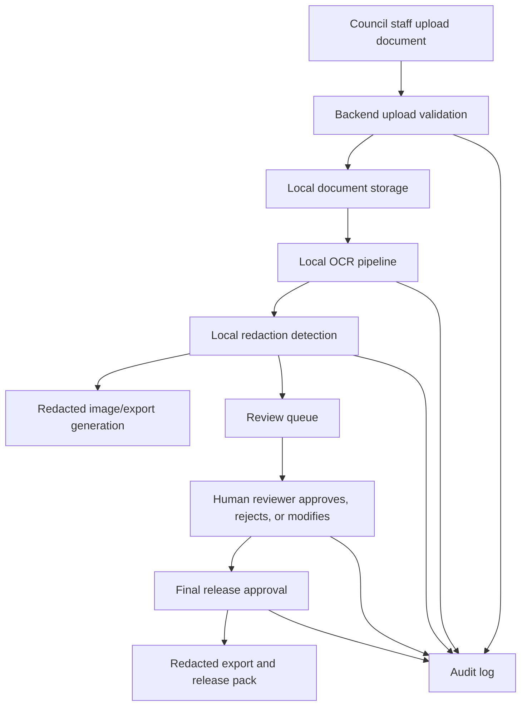

# Data Flow

## Real Document Rule

Real council documents must remain inside council-controlled infrastructure. External AI, OCR, image-generation, or evaluation services must not receive real council documents by default.

## Stored Data

- Original upload.
- Processed/redacted image.
- OCR text and OCR metadata.
- Redaction records, including type, confidence, method, bounding box, status, and original detected value.
- Export files.
- Audit logs.
- User account and role metadata.

## Production Controls Still Required

- Encryption at rest.
- Secure deletion and retention purge.
- Backup and restore procedures.
- Operational logging that excludes OCR text and sensitive values.

